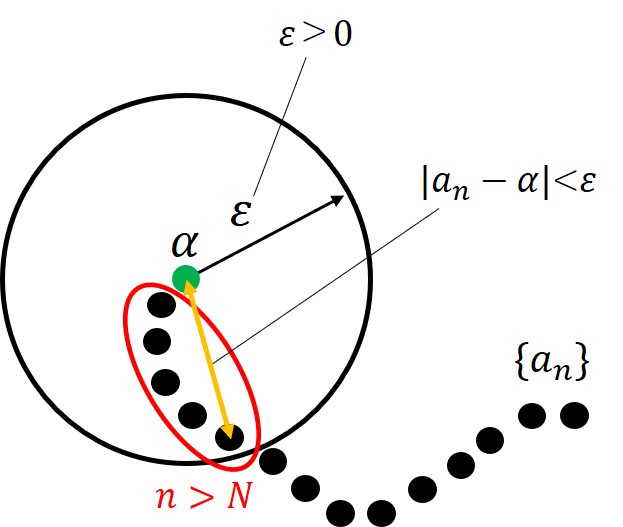

Initial version: 2022/06/18
Revised: 2023/02/11

# 微積分学

「はじめに」の表記法を使って、微積分の計算を学ぶ。
数学 Ⅲ の内容を発展させたイメージ。

---

## 内容

- [微積分学](#微積分学)
  - [内容](#内容)
  - [1. 1 変数の微分法](#1-1-変数の微分法)
  - [2. 1 変数の積分法](#2-1-変数の積分法)
  - [3. 多変数の積分法](#3-多変数の積分法)
  - [4. 多変数の微分法](#4-多変数の微分法)

## 1. 1 変数の微分法

- 級数と極限

数学 Ⅲ の関数と極限では、連続の概念と $lim$ を用いた計算を行った。ここでは更に、厳密な定義を通して収束の概念を定める。ここでの内容は、位相空間論でより抽象的に扱う。

計算値が収束することは、見通しが良くなるため非常に望ましい性質である。ある数列に対し、その収束を次式で定義する。

<定義>
数列 $\{a_n\}$ が $\alpha$ に収束するとは、任意の正の数 $\varepsilon$ (イプシロン) に対してある $N$ があり、$n > N$ ならば $a_n$ と $\alpha$ の距離が $\varepsilon$ より小さくなることである。つまり、

$\forall \varepsilon$, $\exists N$ s.t. $n > N$ $\Rightarrow |a_n - \alpha| < \varepsilon$.

ここで、$\forall$ は「任意の」を表す記号であり、$\exists$ は「ある～」という意味の記号を表す。
また、s.t. = such that の略で、「～を満たすような」という意味を表す。

上の定義は何を言っているのか理解しづらいため、かみ砕いて考える。下図に定義式のイメージを示した。

まず、$\varepsilon$ は(０に近い非常に小さな)半径を表している。定義では、添字 $1, 2, \dots, N, \dots, n$ の数列に対し、$N$ 以降の(値が大きな)数列を考えている。

次に、この $n > N$ を満たす数列 $a_n$ ならば、 $\alpha$ との距離が半径 $\varepsilon$ の円内に収まる。半径 $\varepsilon$ の大きさは任意に拡大・縮小できるが、0 に非常に近い値(例えば、0.00000000001)とすれば、距離 $|a_n - \alpha|$ が 0 に近づく。

このように考えることで、$\lim_{n \to \infty} a_n = \alpha$ を定義することができる。これを、$\varepsilon - N$ 論法という。

<例>
数列 $a_n = \frac{1}{n}$ を考えよう。
$n$ が 1 億の場合、0 に近い値となる。よって、$\lim_{n \to \infty} a_n = 0$ と書ける。定義式に当てはめ、確かてみよう。
$\varepsilon = 0.01$、 $N = 100$、$\alpha = 0$ とおくと、

$n > N = 100$ で $ |a_n - \alpha| = |\frac{1}{n}| < \varepsilon = 0.01$

となり、100 より大きな $n$ ならば、距離$|a_n - \alpha|$はこのように 0.01 より小さくなる。ここで、ある $N$ は $\varepsilon$ の定め方に依存することに注意しよう。$\varepsilon$ は任意のため、大きな $N$ の値に対して半径 $\varepsilon$ を調節すればいい。

- Taylor 展開

## 2. 1 変数の積分法

## 3. 多変数の積分法

## 4. 多変数の微分法
